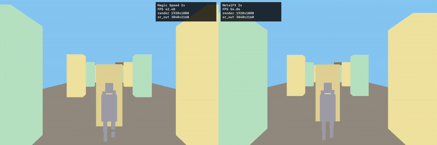
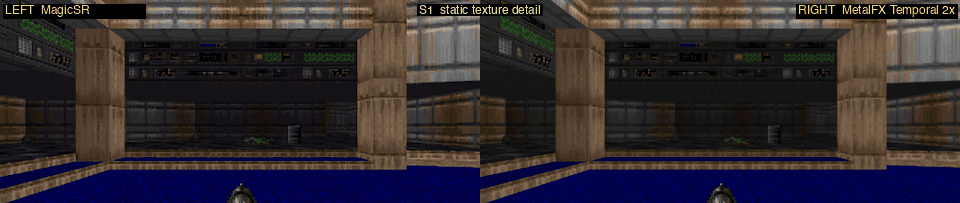
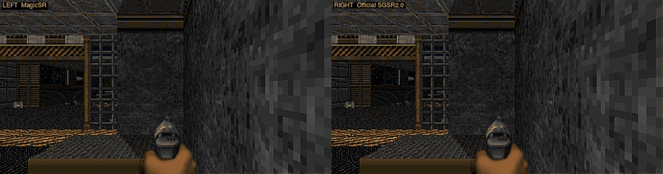
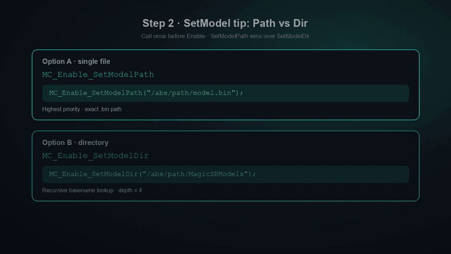

# MagicSR: MagicCode AI Super-Resolution, 1080P@240fps on iPhone14Pro

MagicSR is MagicCode's AI super-resolution solution for mobile video and image enhancement.

MagicCode developed a fast convolution method called **PACA**, which accelerates convolution computation by dozens of times without sacrificing numerical accuracy. Based on this method, we designed MagicSR to provide strong visual quality with production-ready speed.

The MagicSR network delivers the ultra-fast processing speed typically associated with traditional image-processing algorithms, while preserving the strong AI super-resolution quality of neural approaches. To cover most mobile devices from low-end to high-end, we provide two MagicSR modes: Speed and Balanced. Balanced produces higher image quality and is better suited to mid- to high-end devices, while Speed runs faster(1080P@240fps on iPhone14Pro) and enables smooth performance on lower-compute devices.

Official page: [https://www.magiccode-ai.com/products/video-super-resolution](https://www.magiccode-ai.com/products/video-super-resolution)

> Note: the comparison videos in the "MagicSR Overview" section are intentionally omitted here.

## MagicSR Performance

To evaluate MagicSR, we compared it with two benchmark super-resolution algorithms on mobile devices: Apple Metal4 MetalFX and Qualcomm Snapdragon SGSR (2x super-resolution). The results show:

### 2x Spatial Super-Resolution Processing Speed Test

#### iOS Super-Resolution Speed Comparison

Test platform: A16Pro CPU. Metric: processing time in ms.

| Method | Time (ms) |
| --- | ---: |
| Bilinear | 2.38 |
| MagicSR Spatial Speed | 3.12 |
| MagicSR Spatial Balanced | 8.51 |
| MetalFX-Spatial | 8.82 |

#### Android Vulkan Super-Resolution Speed Comparison

Test platform: Qualcomm Snapdragon 888 CPU. Metric: processing time in ms.

| Method | Time (ms) |
| --- | ---: |
| Bilinear | 2.918 |
| MagicSR Spatial Speed | 3.93 |
| SGSR1.0 | 4.678 |
| MagicSR Spatial Balanced | 17.82 |

### MagicSR Balanced vs Apple MetalFx

In a 3D game running on iPhone 14 Pro, MagicSR maintains a stable 60 fps, while MetalFx averages only 36.6 fps.

<a href="https://github.com/MagicCode-ai/SuperResolution/raw/main/README.assets/compare_magic_speed_vs_metalfx_2x_latest.mp4">
  
</a>

[**▶ Watch full video (MP4)**](https://github.com/MagicCode-ai/SuperResolution/raw/main/README.assets/compare_magic_speed_vs_metalfx_2x_latest.mp4)

### 2x Spatial Super-Resolution Image Quality Comparison

The image quality comparison shows outputs from Bilinear, SGSR1.0, MagicSR Speed, and MetalFX-Spatial. It can be used to examine edge clarity, fine textures, artifacts, noise amplification, and overall naturalness.

#### Spatial SR Comparison

| Bilinear | MagicSR Speed |
| :---: | :---: |
|  |  |
| **SGSR1.0** | **MetalFX-Spatial** |
|  |  |

### 2x Temporal Super-Resolution Processing Speed Test

#### iOS Super-Resolution Speed Comparison

Test platform: A16Pro CPU. Metric: processing time in ms.

| Method | Time (ms) |
| --- | ---: |
| MagicSR Temporal Speed | 17.18 |
| MetalFX | 17.73 |
| MagicSR Temporal Balanced | 23.88 |

#### Android Vulkan Super-Resolution Speed Comparison

Test platform: Qualcomm Snapdragon 888 CPU. Metric: processing time in ms.

| Method | Time (ms) |
| --- | ---: |
| SGSR2.0 | 22.231 |
| MagicSR Temporal Speed | 22.648 |
| MagicSR Temporal Balanced | 28.901 |

### 2x Temporal Super-Resolution Image Quality Comparison

<p align="center"><strong>MagicSR (left) vs MetalFX (right)</strong></p>



<p align="center"><strong>MagicSR (left) vs Official SGSR2.0 (right)</strong></p>



### Game Demo: Original Res vs Low Res+MagicSR

In-game clip with on-screen HUD comparing the original stream against MagicSR.

<a href="https://github.com/MagicCode-ai/SuperResolution/raw/main/README.assets/game_16-26s_vs_magicsr_clip_hud.mp4">
  
</a>

[**▶ Watch full video (MP4)**](https://github.com/MagicCode-ai/SuperResolution/raw/main/README.assets/game_16-26s_vs_magicsr_clip_hud.mp4)

### Productization Support

In addition to its advantages in processing speed and image quality, MagicSR is product-ready: it supports mainstream mobile backends such as Metal, Vulkan, and OpenGLES, and provides Unity and UE plugins.

MagicSR supports mainstream CPU and GPU backends:

- X86 SIMD
- Neon
- Metal
- Vulkan
- Dx11
- OpenGLES
- OpenGL

## Quick Start

Quick integration via the Enable API: include the header, set the model directory, enable with an input texture and scale, then disable when finished.

```c
#include "mc_enable.h"
MC_Enable_SetModelDir("/path/to/MagicSRModels");  // or MC_Enable_SetModelPath(".../model.bin")
void* output = MC_Enable(input, scale);           // use output
MC_Disable(output);
```

Unity / Unreal plugins follow the same flow as `SetModelDir` → `Enable(input, scale)` → `Disable()`.

<a href="README.assets/MagicSR_Quick_Integration.mp4">
  
</a>

[**▶ Watch full tutorial (MP4)**](README.assets/MagicSR_Quick_Integration.mp4)

For full details, see the [User Guide](doc/User_Guide.md).

## License

MagicSR is **free to download and use** under the [End User License Agreement (EULA) v1.1](doc/MagicCode%20Super-Resolution%20Software%20End%20User%20License%20Agreement%20(EULA)%20v1.1.pdf).

The EULA grants a no-charge license to the Software itself. **Professional services** — such as integration assistance, custom development, consulting, training, priority support, and SLA commitments — are **not included** in the free Software license and require a separate paid Services Agreement.

Community feedback may be submitted via GitHub Issues on an as-is basis without guaranteed response times.

Related legal documents are available in the [`doc/`](doc/) directory, including the Privacy Policy and Data Reporting Notice.

## Contact

- **Website:** [https://www.magiccode-ai.com/](https://www.magiccode-ai.com/)
- **Software download and documentation:** this repository
- **Professional services and business cooperation:** contact us through the official website

---

© 2026 MagicCode Technology Limited. All rights reserved.
