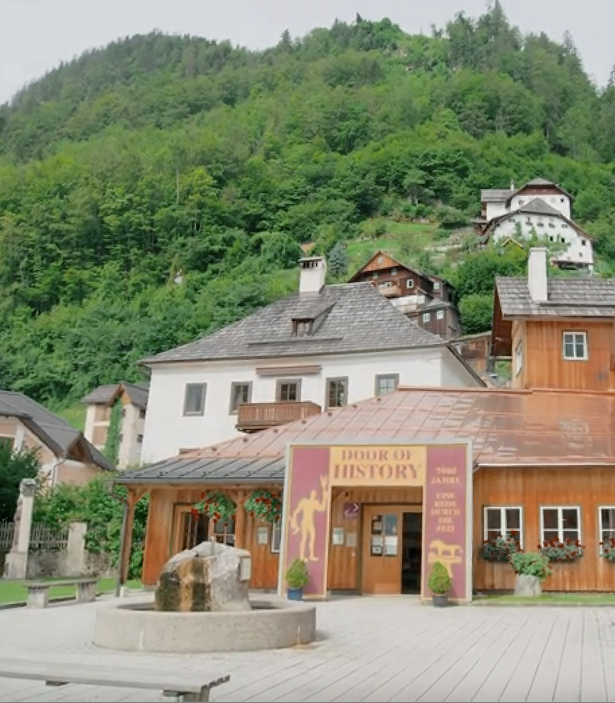
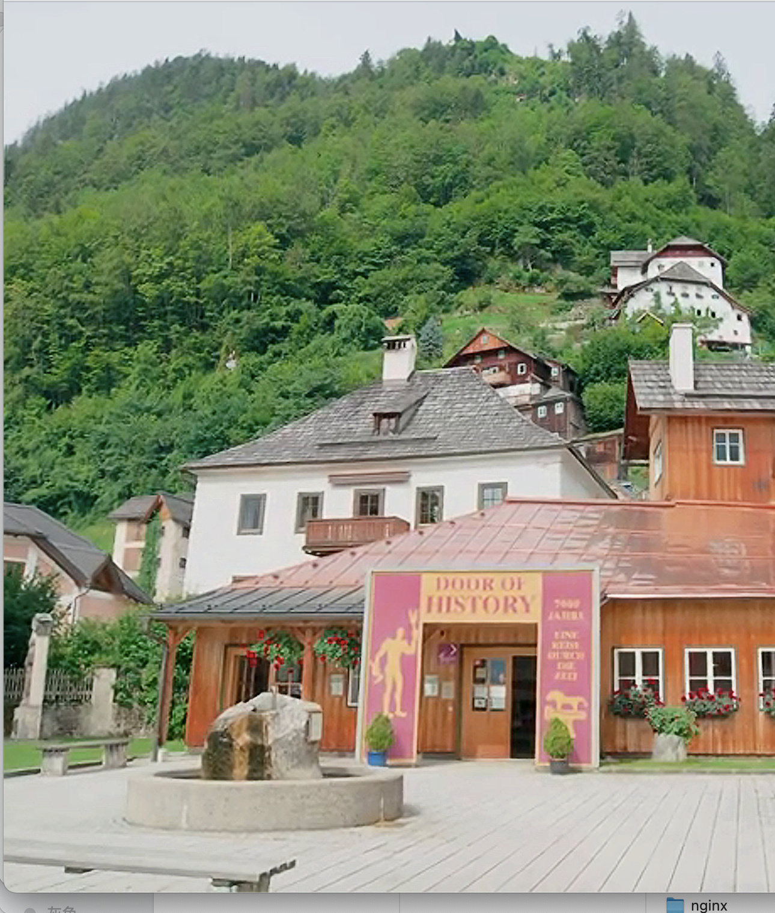
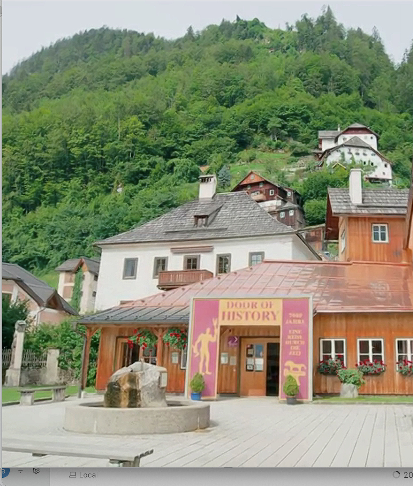
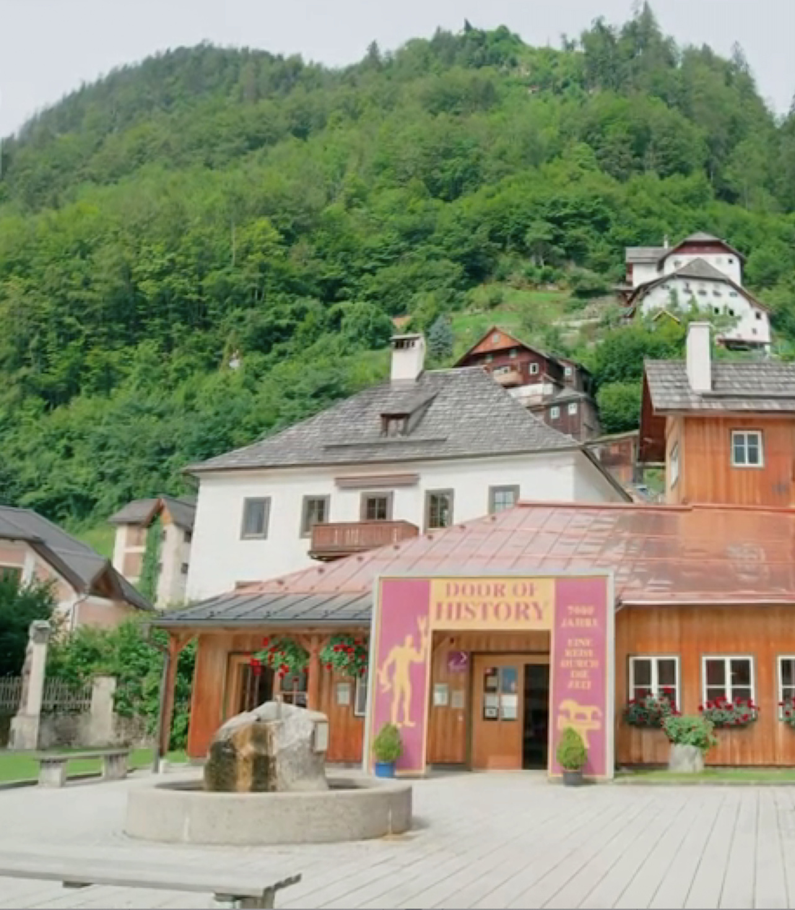
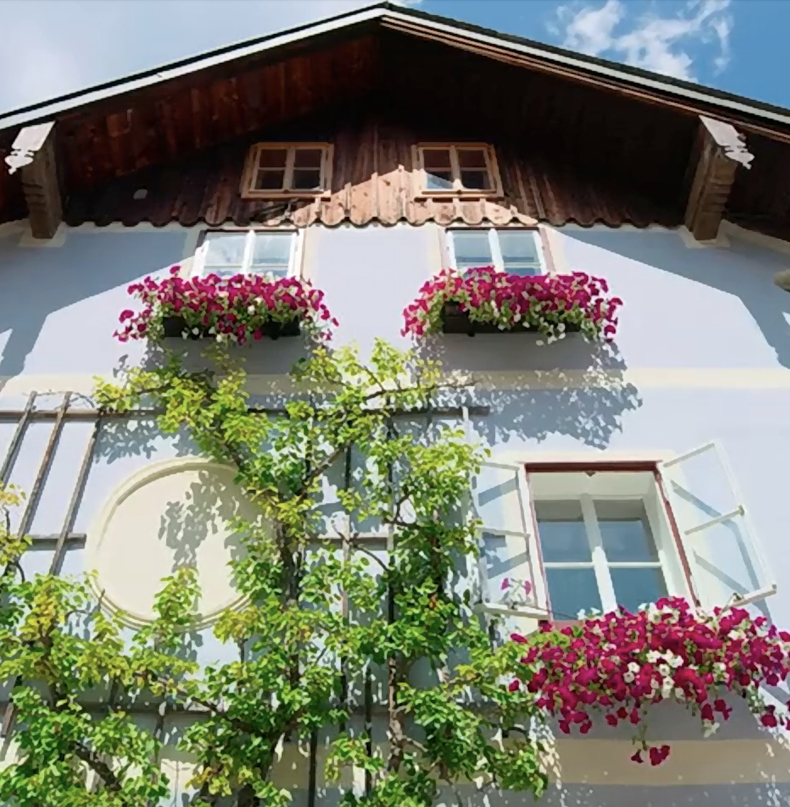
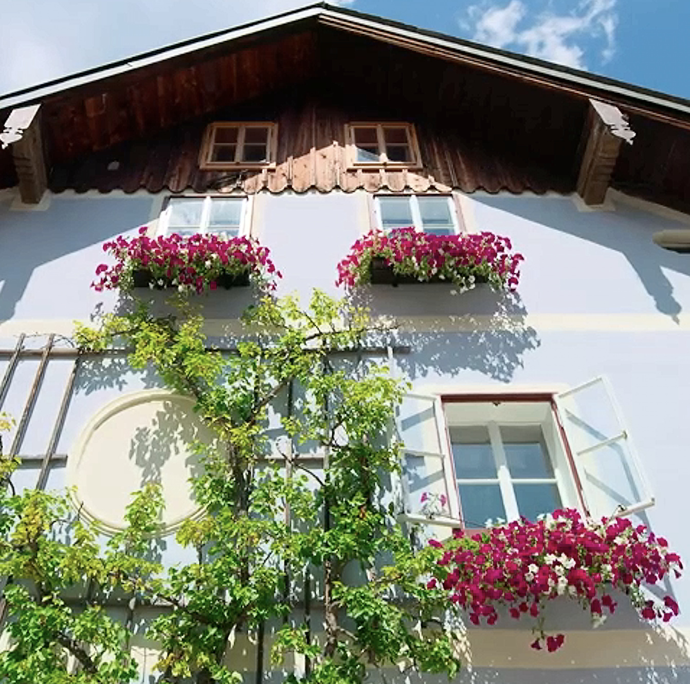
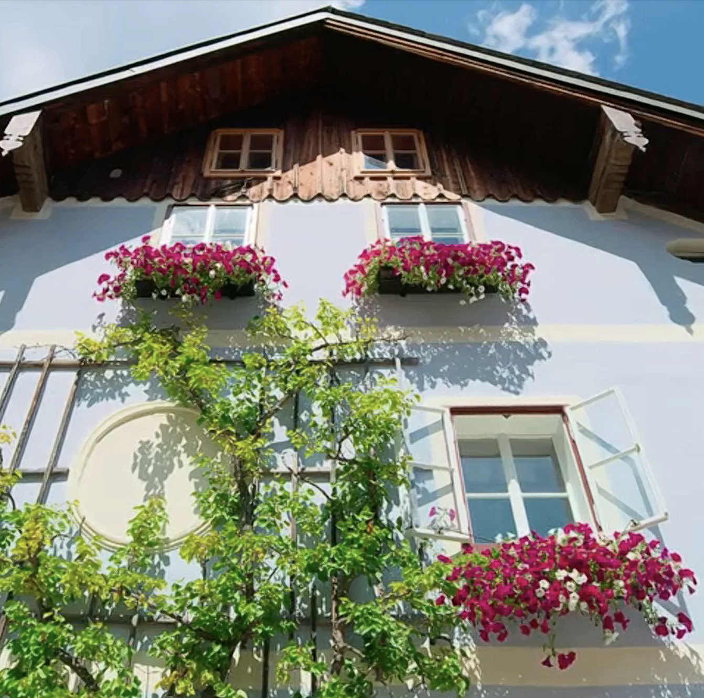
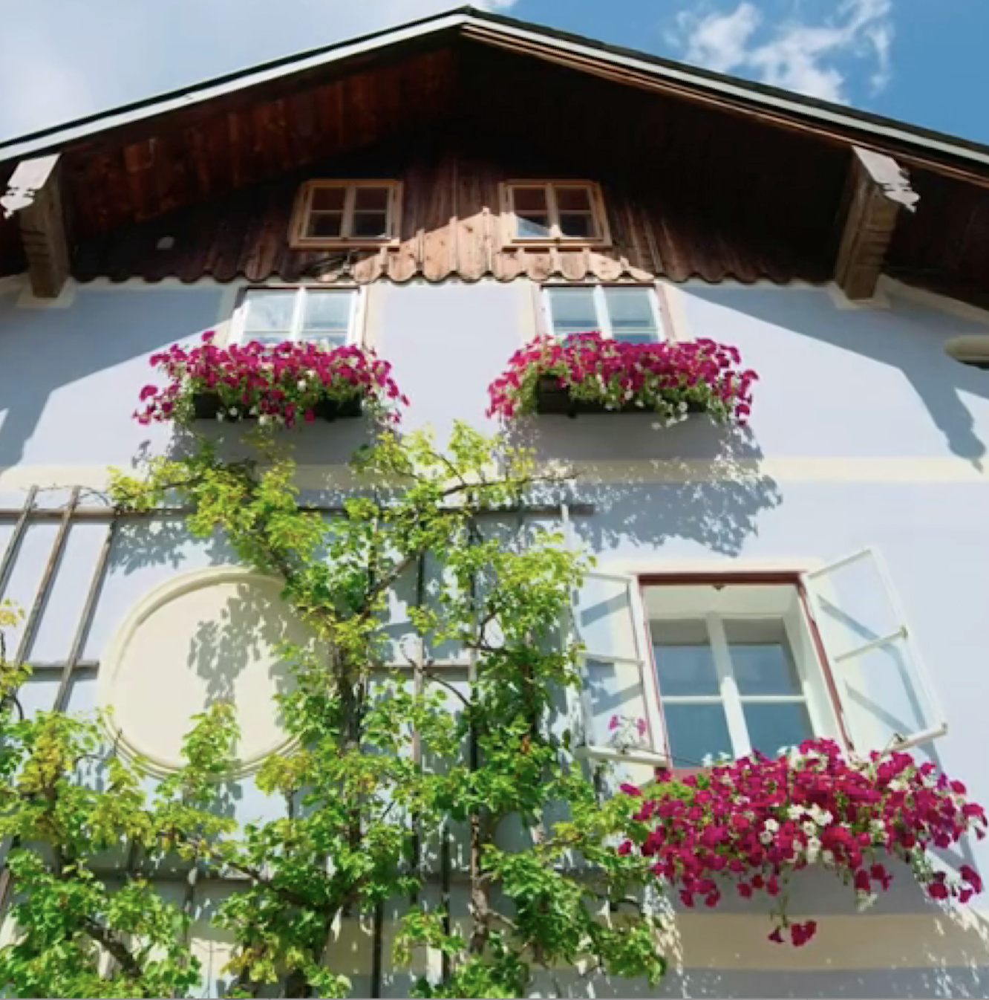

# MagicSR: MagicCode AI Super-Resolution

MagicSR is MagicCode's AI super-resolution solution for mobile video and image enhancement.

MagicCode developed a fast convolution method called **PACA**, which accelerates convolution computation by dozens of times without sacrificing numerical accuracy. Based on this method, we designed MagicSR to provide strong visual quality with production-ready speed.

The MagicSR network delivers the ultra-fast processing speed typically associated with traditional image-processing algorithms, while preserving the strong AI super-resolution quality of neural approaches. To cover most mobile devices from low-end to high-end, we provide two MagicSR modes: HighSpeed and Speed. Speed produces higher image quality and is better suited to mid- to high-end devices, while HighSpeed runs faster and enables smooth performance on lower-compute devices.

Official page: [https://www.magiccode-ai.com/products/video-super-resolution](https://www.magiccode-ai.com/products/video-super-resolution)

> Note: the comparison videos in the "MagicSR Overview" section are intentionally omitted here.

## MagicSR Performance

To evaluate MagicSR, we compared it with benchmark mobile SR solutions including Apple MetalFX and Qualcomm SGSR (2x super-resolution).

### iOS / iPadOS

- Image quality: `MagicSR-Speed > MagicSR-HighSpeed >= MetalFX-Temporal > MetalFX-Spatial`
- Processing speed: `MagicSR-HighSpeed > MagicSR-Speed > MetalFX-Spatial > MetalFX-Temporal`

### Android

- Image quality: `MagicSR-Speed > MagicSR-HighSpeed > SGSR2.0 > SGSR1.0`
- Processing speed: `MagicSR-HighSpeed ≈ SGSR1.0 > MagicSR-Speed > SGSR2.0`

## 2x Super-Resolution Speed Data

### iOS Super-Resolution Speed Comparison (A16 Pro, ms)

| Method | Time (ms) |
| --- | ---: |
| MagicSR HighSpeed | 3.47 |
| MagicSR Speed | 4.83 |
| MetalFX Spatial | 8.82 |
| MetalFX Temporal | 15.28 |

### Android Vulkan Super-Resolution Speed Comparison (Snapdragon 888, ms)

| Method | Time (ms) |
| --- | ---: |
| SGSR1.0 | 4.678 |
| MagicSR HighSpeed | 4.581 |
| MagicSR Speed | 9.91 |
| SGSR2.0 | 13.47 |

## Image Comparison Samples

### Comparison 1

| SGSR1.0 | SGSR2.0 |
| --- | --- |
|  |  |

| MagicSR HighSpeed | MagicSR Speed |
| --- | --- |
|  |  |

| MetalFX Spatial | MetalFX Temporal |
| --- | --- |
|  |  |

### Comparison 2

| SGSR1.0 | SGSR2.0 |
| --- | --- |
|  |  |

| MagicSR HighSpeed | MagicSR Speed |
| --- | --- |
|  |  |

| MetalFX Spatial | MetalFX Temporal |
| --- | --- |
|  |  |

### Comparison 3

| SGSR1.0 | SGSR2.0 |
| --- | --- |
|  |  |

| MagicSR HighSpeed | MagicSR Speed |
| --- | --- |
|  |  |

| MetalFX Spatial | MetalFX Temporal |
| --- | --- |
|  |  |

## Productization Support

MagicSR supports mainstream  GPU backends:

- Metal
- Vulkan
- OpenGLES
- OpenGL

And provides integration support for:

- Unity plugin (supports Unity 2022.3.62f2c1)
- Unreal Engine plugin (supports UE 5.0, 5.1, 5.2, 5.3, 5.4, 5.6, 5.7, 5.8)

## Contact

For customized AI super-resolution solutions and business cooperation:

- Website: [https://www.magiccode-ai.com/](https://www.magiccode-ai.com/)

---

© 2024 MagicCode Technology Limited. All rights reserved.
